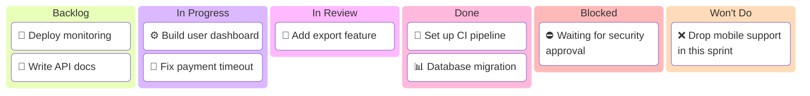

<!-- Source: https://github.com/SuperiorByteWorks-LLC/agent-project | License: Apache-2.0 | Author: Clayton Young / Superior Byte Works, LLC (Boreal Bytes) -->

# Kanban Board Documentation Template

> **Back to [Markdown Style Guide](../markdown_style_guide.md)** — Read the style guide first for formatting, citation, and emoji rules.

**Use this template for:** Tracking work items, sprint boards, project task management, release planning, or any scenario where you need a persistent, markdown-based view of work status. This board IS the tracking system — a file in your repo that evolves with your codebase.

**Key features:** Visual Mermaid kanban diagram, work item tables with status tracking, WIP limits, blocked items, explicit Won't Do decisions, aging indicators, flow efficiency metrics, and historical throughput.

**Philosophy:** This board is a file. Modify it in your branch, merge it with your PR. The board evolves WITH the codebase — no external board tool required. Anyone with repo access sees the board, AI agents included.

A kanban board's job is to make work visible. This template serves two purposes: (1) a living board that gets updated as work progresses, and (2) a historical snapshot when archived. The Mermaid diagram gives the instant visual overview; the tables give the detail. Together they answer: What's being worked on? What's blocked? What's done? What's next?

When archived, the board becomes the historical record of what was worked on, what was blocked, and what was completed — all in git history, with full attribution and timestamps. This is the [Everything is Code](../markdown_style_guide.md#-everything-is-code) philosophy: project management data lives in the repo, versioned and portable.

---

## File Convention

```
docs/project/kanban/sprint-2026-w07-agentic-template-modernization.md
docs/project/kanban/release-v2.3.0-launch-readiness.md
docs/project/kanban/project-auth-migration-phase-1.md
```

- **Directory:** `docs/project/kanban/`
- **Naming:** Prefix with board scope (`sprint-`, `release-`, `project-`) + identifier + short lowercase hyphenated description
- **Archiving:** When a board is complete, keep it in place — it becomes the historical record

---

## The Template

Everything below the line is the template. Copy from here:

---

# [Board Name] — Kanban Board

_[Scope: Sprint W07 2026 / Release v2.3.0 / Project: Auth Migration]_
_[Team/Owner] · Last updated: [YYYY-MM-DD HH:MM]_

---

## 📋 Board Overview

**Period:** [Start date] → [End date]
**Goal:** [One sentence — what does "done" look like for this board?]
**WIP Limit:** [Max items in "In Progress" — e.g., 3 per person, 6 total]

### Visual board

_Kanban board showing current work distribution across backlog, in-progress, review, done, blocked, and Won't Do columns:_



> ⚠️ Always show all 6 columns — Even if a column has no items, include it with a placeholder. This makes the board structure explicit and ensures categories are never forgotten. Use a placeholder like [No items yet] when a column is empty.

---

## 🚦 Board Status

| Column             | Count | WIP Limit | Status                                         |
| ------------------ | ----- | --------- | ---------------------------------------------- |
| 📋 **Backlog**     | [N]   | —         | [Notes]                                        |
| 🔄 **In Progress** | [N]   | [Limit]   | [🟢 Under limit / 🟡 At limit / 🔴 Over limit] |
| 🔍 **In Review**   | [N]   | [Limit]   | [Status]                                       |
| ✅ **Done**        | [N]   | —         | [This period]                                  |
| 🚫 **Blocked**     | [N]   | —         | [See blocked section below]                    |
| 🚫 **Won't Do**    | [N]   | —         | [Explicitly declined with rationale]           |

> ⚠️ **Always include all 6 columns** — Each column represents a workflow state. Even if count is 0, keep the row visible. This prevents categories from being overlooked.

---

## 📋 Backlog

_Prioritized top-to-bottom. Top items are next to be pulled. Include at least one placeholder item if empty._

| #   | Item              | Priority  | Estimate | Assignee | Notes                   |
| --- | ----------------- | --------- | -------- | -------- | ----------------------- |
| 1   | [Work item title] | 🔴 High   | [S/M/L]  | [Person] | [Context or dependency] |
| 2   | [Work item title] | 🟡 Medium | [Size]   | [Person] | [Notes]                 |
|     | _[No items yet]_  |           |          |          |                         |

---

## 🔄 In Progress

_Items currently being worked on. Include at least one placeholder item if empty._

| Item        | Assignee | Started | Expected | Days in column | Aging | Status           |
| ----------- | -------- | ------- | -------- | -------------- | ----- | ---------------- |
| [Work item] | [Person] | [Date]  | [Date]   | [N]            | 🟢    | 🟢 On track      |
|             |          |         |          |                |       | _[No items yet]_ |

> 💡 **Aging indicator:** 🟢 Under expected time · 🟡 At expected time · 🔴 Over expected time — items aging red need attention or re-scoping.

> ⚠️ **WIP limit:** [N] / [Limit]. [Under limit / At limit — pull more work / Over limit — finish something before starting new work]

---

## 🔍 In Review

_Items awaiting or in code review. Include at least one placeholder item if empty._

| Item        | Author   | Reviewer | PR                                                                                   | Days in review | Aging | Status                                           |
| ----------- | -------- | -------- | ------------------------------------------------------------------------------------ | -------------- | ----- | ------------------------------------------------ |
| [Work item] | [Person] | [Person] | [#NNN](../../docs/project/pr/pr-00000001-agentic-docs-and-monorepo-modernization.md) | [N]            | 🟢    | [Awaiting review / Changes requested / Approved] |
|             |          |          |                                                                                      |                |       | _[No items yet]_                                 |

---

## ✅ Done

_Completed this period. Include at least one placeholder item if empty._

| Item        | Assignee | Completed | Cycle time | PR                                                                                   |
| ----------- | -------- | --------- | ---------- | ------------------------------------------------------------------------------------ |
| [Work item] | [Person] | [Date]    | [N days]   | [#NNN](../../docs/project/pr/pr-00000001-agentic-docs-and-monorepo-modernization.md) |
|             |          |           |            | _[No items completed this period]_                                                   |

---

## 🚫 Blocked

_Items that cannot proceed. Always include at least the placeholder — blocked items are high-signal and should never be hidden._

| Item        | Assignee | Blocked since | Blocked by                                              | Escalated to  | Unblock action         |
| ----------- | -------- | ------------- | ------------------------------------------------------- | ------------- | ---------------------- |
| [Work item] | [Person] | [Date]        | [What's blocking — dependency, decision, external team] | [Person/team] | [What needs to happen] |
|             |          |               |                                                         |               | _[No blocked items]_   |

> 🔴 **[N] items blocked.** [Summary of what's needed to unblock them.]

---

## 🚫 Won't Do

_Explicitly out of scope for this board period. Capture rationale so these decisions are transparent and auditable. Include placeholder if empty._

| Item        | Date decided | Decision owner | Rationale                                      | Revisit trigger                      |
| ----------- | ------------ | -------------- | ---------------------------------------------- | ------------------------------------ |
| [Work item] | [Date]       | [Person/team]  | [Why this is intentionally excluded right now] | [What change would reopen this item] |
|             |              |                | _[No items explicitly declined]_               |                                      |

---

## 📊 Metrics

### This period

| Metric                             | Value    | Target   | Trend   |
| ---------------------------------- | -------- | -------- | ------- |
| **Throughput** (items completed)   | [N]      | [Target] | [↑/→/↓] |
| **Avg cycle time** (start → done)  | [N days] | [Target] | [↑/→/↓] |
| **Avg lead time** (created → done) | [N days] | [Target] | [↑/→/↓] |
| **Avg review time**                | [N days] | [Target] | [↑/→/↓] |
| **Flow efficiency**                | [N%]     | [Target] | [↑/→/↓] |
| **Blocked items**                  | [N]      | 0        | [↑/→/↓] |
| **WIP limit breaches**             | [N]      | 0        | [↑/→/↓] |
| **Items aging red**                | [N]      | 0        | [↑/→/↓] |

> 💡 **Flow efficiency** = active work time ÷ total cycle time × 100. A healthy team targets 40%+. Below 15% means items spend most of their time waiting, not being worked on.

<details>
<summary><strong>📊 Historical Throughput</strong></summary>

| Period              | Items completed | Avg cycle time | Blocked days |
| ------------------- | --------------- | -------------- | ------------ |
| [Previous period 3] | [N]             | [N days]       | [N]          |
| [Previous period 2] | [N]             | [N days]       | [N]          |
| [Previous period 1] | [N]             | [N days]       | [N]          |
| **Current**         | [N]             | [N days]       | [N]          |

</details>

---

## 📝 Board Notes

### Decisions made this period

- **[Date]:** [Decision and context — e.g., "Deprioritized auth refactor to focus on payment bug"]
- **[Date]:** [Added/updated Won't Do decision with explicit rationale and revisit trigger]

### Carryover from last period

- [Item carried over] — [Why it wasn't completed and current status]

### Upcoming dependencies

- [Date]: [External dependency, release, or event that affects this board]

---

## 🔗 References

- [Live project board](../../docs/project/kanban/sprint-2026-w08-crewai-review-hardening-and-memory.md) — Real-time tracking
- [Previous board](../../docs/project/kanban/sprint-2026-w07-agentic-template-modernization.md) — Last period's snapshot
- [Status report](../../docs/project/pr/pr-00000001-agentic-docs-and-monorepo-modernization.md) — Executive summary of this period

---

_Next update: [Date] · Board owner: [Person/Team]_
