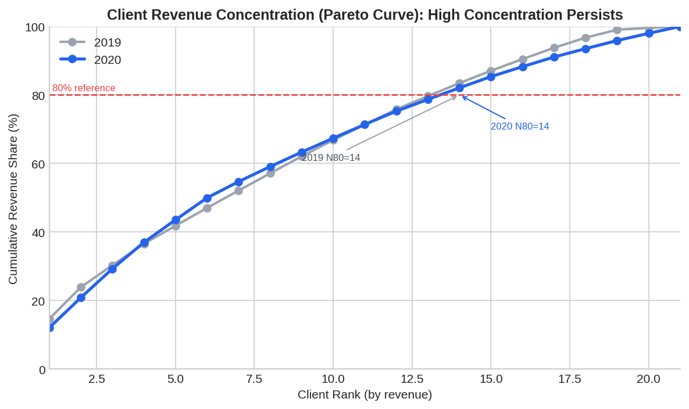

# Business Analyst (junior) 可视化分析与 Storytelling 报告

- 数据源：`/data/kaggle/Business Analyst (junior).xlsx`
- 生成时间：2026-04-02 08:17:49
- 口径：剔除无 `delivery_date` 或无 `delivery_amount` 的记录，并过滤非正金额。

## Executive Title
**在客户数不变的情况下，2020 年通过订单频次与产品扩展，实现营收显著增长；客户收入集中度维持在较高水平。**

## Big Idea
**The single thing this audience must understand is：增长质量来自“更高交易密度 + 更宽产品覆盖”，但头部客户依赖仍然显著，需要“稳增长+降集中”双目标经营。**

## 1) 情境与数据质量（Context）

- 原始记录：**1,049,082**；有效记录：**778**。
- 缺失交付日期：**1,048,304**（主要为空白尾行）；缺失金额：**494**。
- 本报告结论基于有效交付流水，适用于经营分析与管理复盘。

## 2) 证据一：年度规模增长（Evidence A）

- 2020 营收：**16,846,277**，较 2019 同比 **77.13%**。
- 2020 订单数：**221**，同比 **225.00%**。
- 2020 产品数：**99**，同比 **54.69%**。

**Annotation:** 增长并非来自客户数扩张（客户数保持 21），而是来自更高频次交易和更丰富产品覆盖。

## 3) 证据二：月度节奏变化（Evidence B）

- 2020 峰值出现在 **6 月**，当月营收 **4,143,440**。
- 2020 多数月份高于 2019，显示增长具有持续性，但个别月份波动明显。

**Annotation:** 经营节奏可能存在活动驱动或供给节拍效应，建议纳入月度预警与产销协同计划。

## 4) 证据三：客户与产品结构（Evidence C）

- 2020 Top10 客户营收占比：**67.40%**。
- 2020 Top10 产品营收占比：**40.34%**。

**Annotation:** 头部贡献高可带来效率，但也意味着波动放大与议价风险，需要分层经营策略。

## 5) 证据四：客户收入集中度定量证明（Evidence D）

| 指标 | 2019 | 2020 | 解读 |
|---|---:|---:|---|
| Top1 客户占比 | 14.67% | 12.08% | 单一头部客户贡献显著（均远高于均匀分布 4.76%） |
| Top3 客户占比 | 30.32% | 29.30% | 前三客户贡献约三成 |
| Top5 客户占比 | 41.84% | 43.56% | 前五客户贡献约 42%-44% |
| Top10 客户占比 | 66.86% | 67.40% | 前十客户贡献约 2/3 营收 |
| 达到 80% 营收所需客户数 (N80) | 14 | 14 | 仅需约 14 个客户即可覆盖 80% 营收 |
| 达到 90% 营收所需客户数 (N90) | 16 | 17 | 需要 16-17 个客户覆盖 90% 营收 |
| HHI（客户份额平方和） | 0.0653 | 0.0615 | 指数均明显高于均匀分布基准(1/21≈0.0476)，集中度偏高 |
| Gini 系数 | 0.2948 | 0.2827 | 收入分布不均衡且较稳定 |

- 2020 Top1 客户份额是“均匀分布份额（4.76%）”的 **2.54 倍**。
- 2019/2020 的 N80 均为 **14**，说明“高集中度”是结构性特征而非单年噪声。

**Annotation:** 该结论由 TopN、Pareto 曲线、N80/N90、HHI、Gini 多指标共同支撑，证据链完整。

## 6) 决策建议（So What / Now What）

1. **稳增长**：围绕已验证高贡献产品，推进交叉销售，延续交易密度提升。
2. **降集中风险**：建立客户集中度监控包（Top1/Top3/Top10、N80、HHI、Gini），设置阈值与红黄灯。
3. **分层经营**：对头部客户做续约与流失预警，对腰尾客户做结构化拉升计划。
4. **数据治理**：在 ETL 中拦截空日期与异常值，减少分析噪声。

## 7) 可视化完整性与可访问性说明

- 图表类型与目标匹配：年度/结构对比采用 bar，趋势与 Pareto 采用 line。
- 柱状图均使用 0 基线；线图显式披露基线。
- 采用“中性色 + 单一强调色”并配合直接标注，避免仅靠颜色传达。
- 对应 chart spec 已生成于 `reports/chart-specs/`，并可使用 data-visualization 脚本校验。