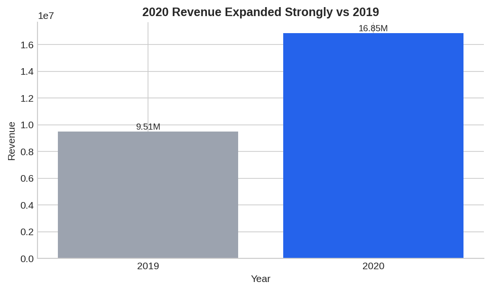
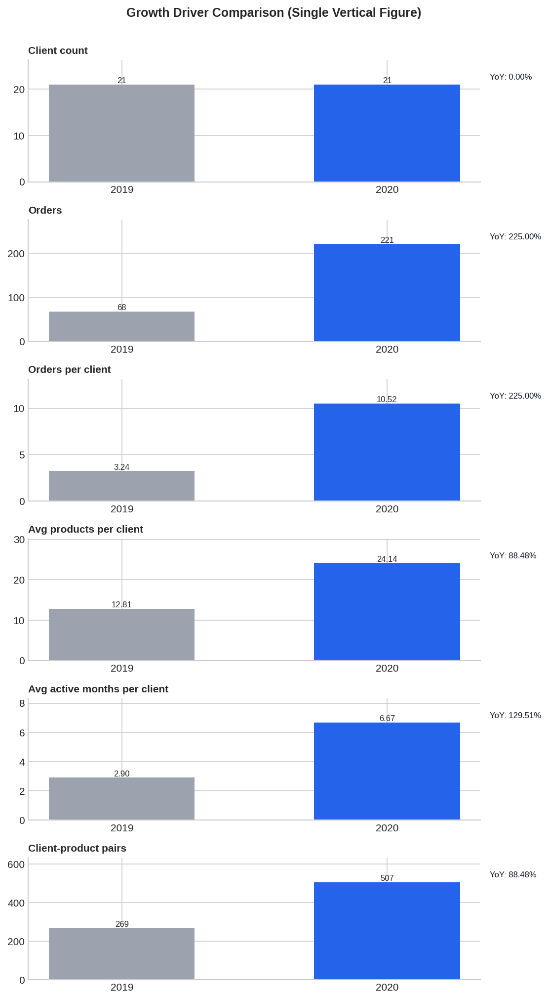
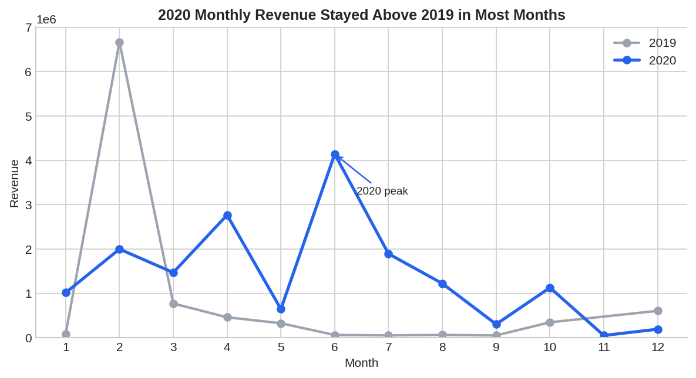
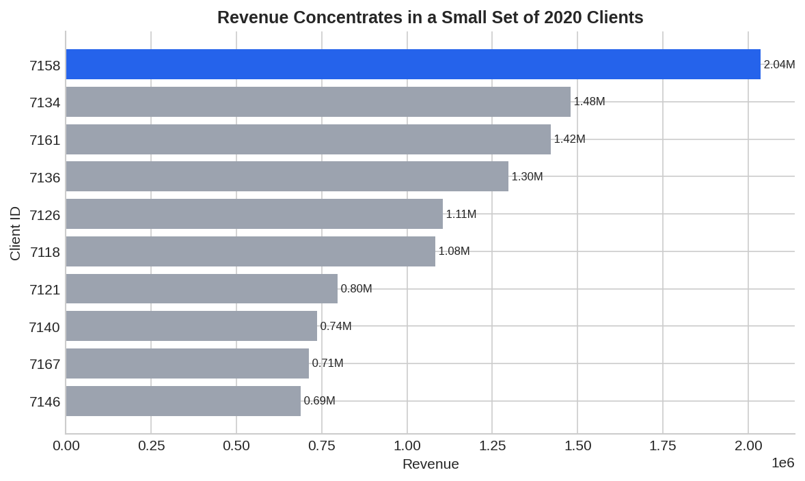
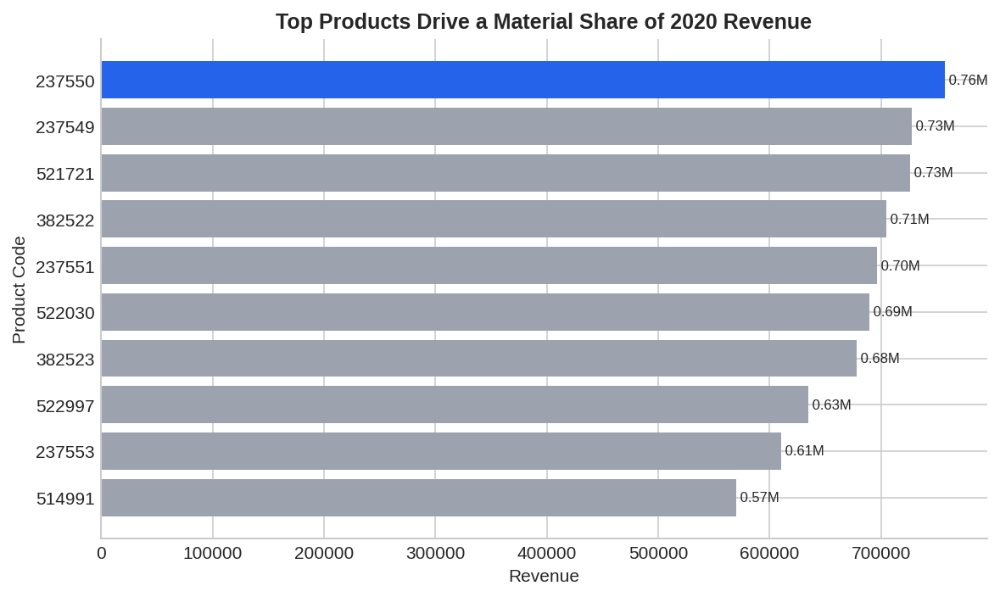
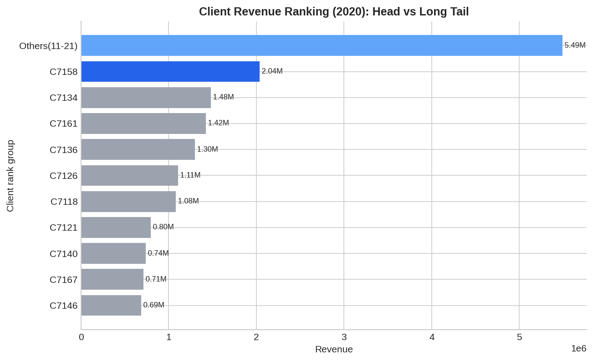
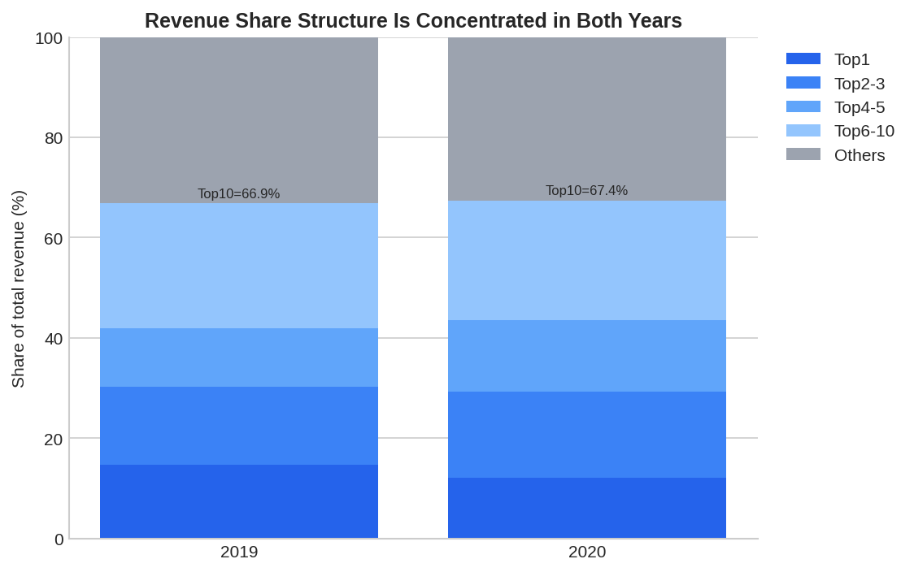
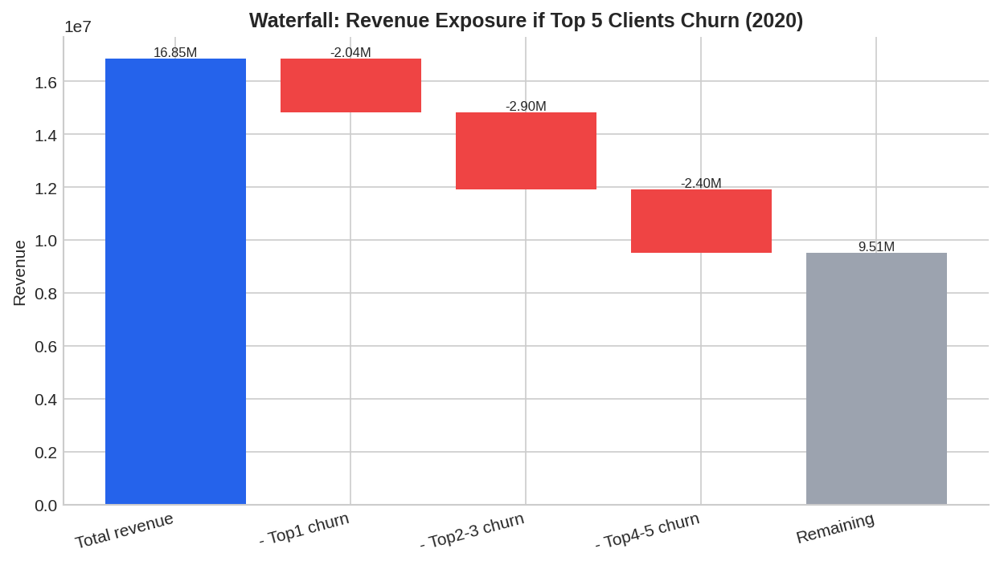

# Business Analyst (junior) 可视化分析与 Storytelling 报告

- 数据源：`/data/kaggle/Business Analyst (junior).xlsx`
- 生成时间：2026-04-02 08:17:49
- 口径：剔除无 `delivery_date` 或无 `delivery_amount` 的记录，并过滤非正金额。

## Executive Title
**在客户数不变的情况下，2020 年通过订单频次与产品扩展，实现营收显著增长；客户收入集中度维持在较高水平。**

## Big Idea
**The single thing this audience must understand is：增长质量来自“更高交易密度 + 更宽产品覆盖”，但头部客户依赖仍然显著，需要“稳增长+降集中”双目标经营。**

## 1) 情境与数据质量（Context）

- 原始记录：**1,049,082**；有效记录：**778**。
- 缺失交付日期：**1,048,304**（主要为空白尾行）；缺失金额：**494**。
- 本报告结论基于有效交付流水，适用于经营分析与管理复盘。

## 2) 证据一：年度规模增长（Evidence A）

- 2020 营收：**16,846,277**，较 2019 同比 **77.13%**。
- 2020 订单数：**221**，同比 **225.00%**。
- 2020 产品数：**99**，同比 **54.69%**。

**逐项文字标注（对应上图）：**
- 客户数：2019 为 **21**，2020 为 **21**（**0.00%**）→ 客户盘子未扩张。
- 订单数：2019 为 **68**，2020 为 **221**（**+225.00%**）→ 交易频次显著提升。
- 每客户订单数：2019 为 **3.24**，2020 为 **10.52**（**+225.00%**）→ 增长核心驱动。
- 平均每客户产品覆盖数：2019 为 **12.81**，2020 为 **24.14**（**+88.48%**）→ 客户可购组合更丰富。
- 平均每客户活跃月数：2019 为 **2.90**，2020 为 **6.67**（**+129.51%**）→ 客户活跃深度提升。
- 客户-产品组合数：2019 为 **269**，2020 为 **507**（**+88.48%**）→ 交叉销售深度提升。

**Data-backed Annotation:** 客户数保持不变（21→21），但频次、覆盖、活跃深度均显著上升，因此增长主要来自“更深经营”而非“更多客户”。

## 3) 证据二：月度节奏变化（Evidence B）

- 2020 峰值出现在 **6 月**，当月营收 **4,143,440**。
- 2020 多数月份高于 2019，显示增长具有持续性，但个别月份波动明显。

**Annotation:** 经营节奏可能存在活动驱动或供给节拍效应，建议纳入月度预警与产销协同计划。

## 4) 证据三：客户与产品结构（Evidence C）

- 2020 Top10 客户营收占比：**67.40%**。
- 2020 Top10 产品营收占比：**40.34%**。

**Annotation:** 头部贡献高可带来效率，但也意味着波动放大与议价风险，需要分层经营策略。

## 5) 证据四：客户收入集中度（图形组合证明）（Evidence D）

| 直观指标（2020） | 数值 | 业务含义 |
|---|---:|---|
| Top1 客户贡献 | 2,035,274（12.08%） | 单一客户贡献超过总收入的 1/10 |
| Top3 客户贡献 | 4,935,915（29.30%） | 前 3 个客户接近贡献 1/3 收入 |
| Top5 客户贡献 | 7,337,913（43.56%） | 前 5 个客户贡献接近一半收入 |
| Top10 客户贡献 | 11,354,507（67.40%） | 前 10 个客户贡献约 2/3 收入 |
| 流失 Top1 客户 | -2,035,274（-12.08%） | 单一客户流失即可造成两位数收入下滑 |
| 流失 Top5 客户 | -7,337,913（-43.56%） | 风险敞口接近“半壁营收” |

**Annotation:** 通过“排名对比 + 结构占比 + 流失冲击”三类图，能直接看到集中度高且风险影响大。

## 6) 决策建议（So What / Now What）

1. **稳增长**：围绕已验证高贡献产品，推进交叉销售，延续交易密度提升。
2. **降集中风险**：建立客户集中度监控包（Top1/Top3/Top5/Top10 贡献、流失 Top1/Top5 情景损失），设置阈值与红黄灯。
3. **分层经营**：对头部客户做续约与流失预警，对腰尾客户做结构化拉升计划。
4. **数据治理**：在 ETL 中拦截空日期与异常值，减少分析噪声。

## 7) 可视化完整性与可访问性说明

- 图表类型与目标匹配：年度/结构对比采用 bar，趋势采用 line；集中度采用排名条形图+100%堆叠+瀑布图组合。
- 柱状图均使用 0 基线；线图显式披露基线。
- 采用“中性色 + 单一强调色”并配合直接标注，避免仅靠颜色传达。
- 对应 chart spec 已生成于 `reports/chart-specs/`，并可使用 data-visualization 脚本校验。