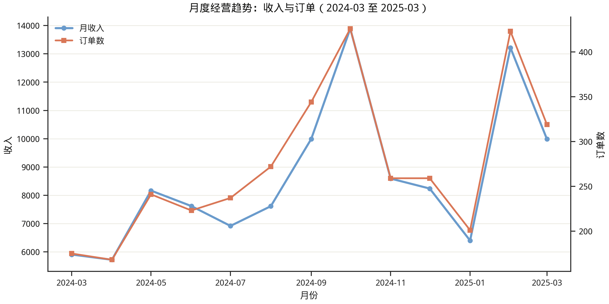
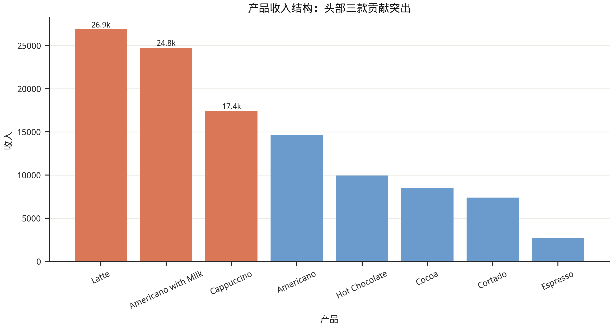
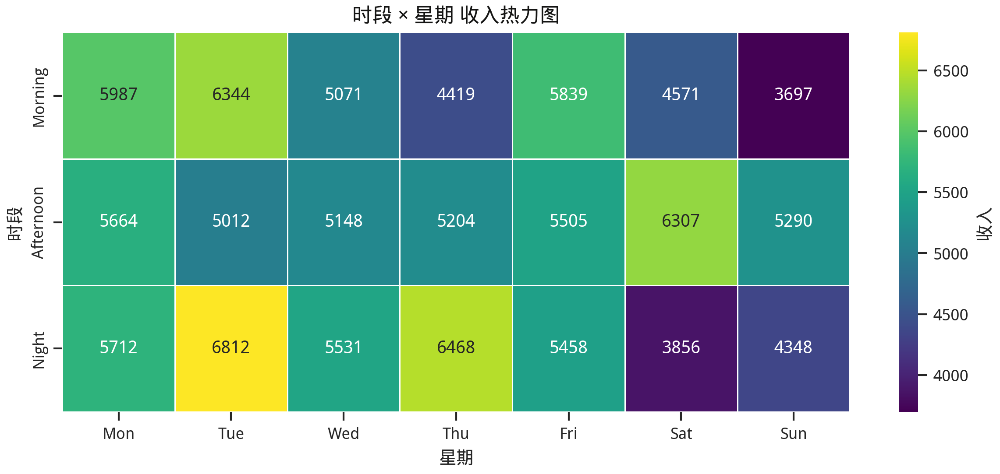
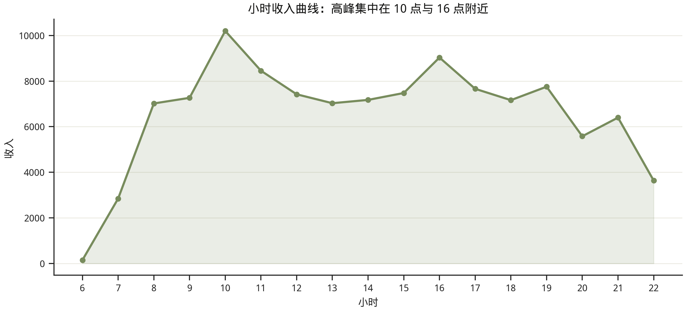
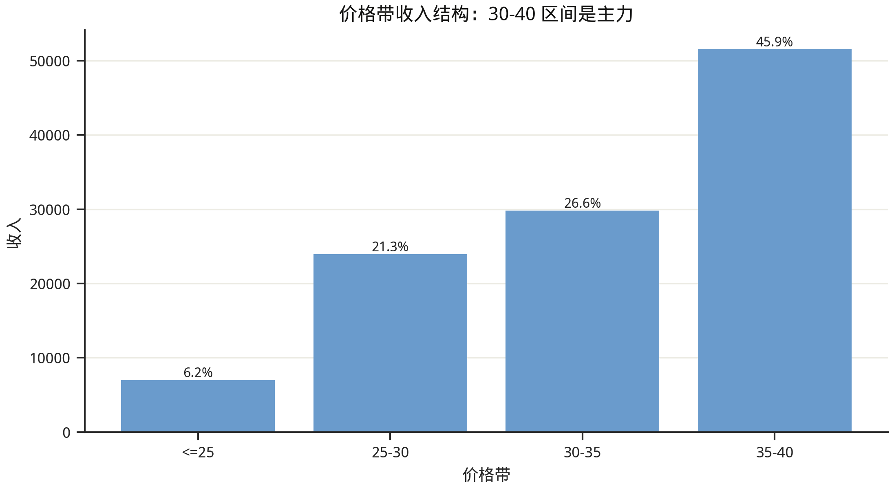

# Coffee Sales 出版级商业分析报告

- 数据文件：`/workspace/data/Coffe_sales.csv`
- 生成时间：2026-04-03 12:13:53
- 报告定位：面向经营管理层，用于月度复盘与增长决策。

## 一、管理摘要（Executive Summary）

- 样本覆盖 **381** 个营业日，共 **3547** 笔订单，累计收入 **112,245.58**。
- 平均客单价 **31.65**，在 **8** 个产品中，头部三款贡献收入 **61.53%**。
- 月度最高收入出现在 **2024-10**（13,891.16），最低在 **2024-04**（5,719.56）。
- 收入高峰集中在 **10:00** 与 **16:00**，周内表现强于周末，周二与周一贡献最高。

## 二、核心图表证据（Publication Figures）

### 图1：月度经营趋势（收入 + 订单）

### 图2：产品收入结构

### 图3：时段 × 星期收入热力图

### 图4：小时收入曲线

### 图5：价格带收入结构

## 三、业务洞察与经营含义

1. **产品结构有明显头部效应**：头部三款产品贡献接近一半收入，菜单优化应优先围绕核心品类。
2. **需求具有明显时段性**：上午和下午后段是核心窗口，运营上应强化备货与排班。
3. **周内与周末表现差异显著**：周二/周一表现最好，周日偏弱，周末需要专项拉动策略。
4. **价格带集中在主力区间**：30-40 区间贡献高，适合做提档不提价感知的组合升级。

## 四、可执行经营建议（90天）

- 把高峰小时（10点、16点）的产品组合做成标准化套餐，并在相邻小时提前预热，拉长高峰。
- 围绕头部产品（Americano with Milk、Latte、Americano）做捆绑与加价购，提升客单价和连带率。
- 针对周末低表现时段设置主题活动与限时优惠，优先提升周日收入。
- 建立周度看板：订单数/收入/客单价/头部产品占比/高峰时段转化。

## 五、关键数据表

### 1) 产品表现（Top 8）

| 产品 | 收入 | 占比 | 订单数 | 客单价 |
|---|---:|---:|---:|---:|
| Latte | 26,875.30 | 23.94% | 757 | 35.50 |
| Americano with Milk | 24,751.12 | 22.05% | 809 | 30.59 |
| Cappuccino | 17,439.14 | 15.54% | 486 | 35.88 |
| Americano | 14,650.26 | 13.05% | 564 | 25.98 |
| Hot Chocolate | 9,933.46 | 8.85% | 276 | 35.99 |
| Cocoa | 8,521.16 | 7.59% | 239 | 35.65 |
| Cortado | 7,384.86 | 6.58% | 287 | 25.73 |
| Espresso | 2,690.28 | 2.40% | 129 | 20.85 |

### 2) 星期表现

| 星期 | 收入 | 订单数 | 客单价 |
|---|---:|---:|---:|
| Mon | 17,363.10 | 544 | 31.92 |
| Tue | 18,168.38 | 572 | 31.76 |
| Wed | 15,750.46 | 500 | 31.50 |
| Thu | 16,091.40 | 510 | 31.55 |
| Fri | 16,802.66 | 532 | 31.58 |
| Sat | 14,733.52 | 470 | 31.35 |
| Sun | 13,336.06 | 419 | 31.83 |

### 3) 时段表现

| 时段 | 收入 | 订单数 | 客单价 |
|---|---:|---:|---:|
| Night | 38,186.34 | 1161 | 32.89 |
| Afternoon | 38,130.04 | 1205 | 31.64 |
| Morning | 35,929.20 | 1181 | 30.42 |

## 六、数据附录文件

- `data/monthly_trend.csv`
- `data/product_performance.csv`
- `data/weekday_performance.csv`
- `data/time_of_day_performance.csv`
- `data/hourly_performance.csv`
- `data/price_band_mix.csv`